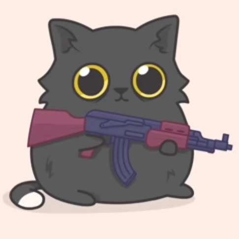
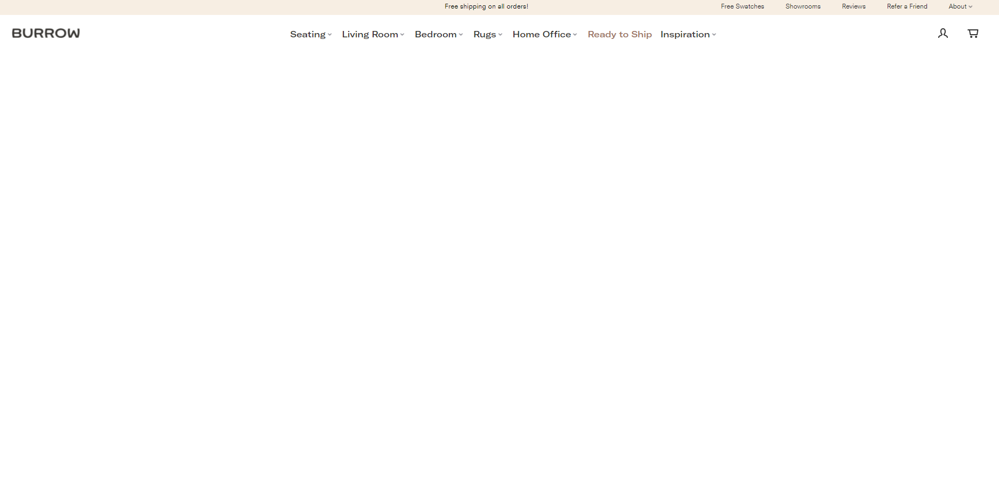
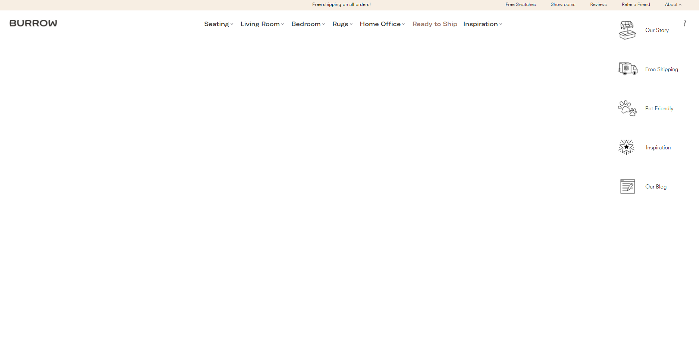
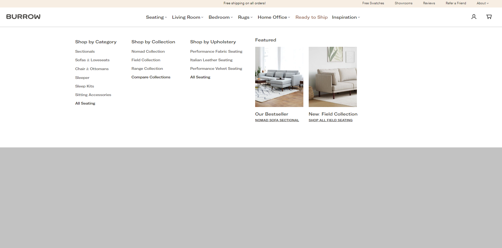
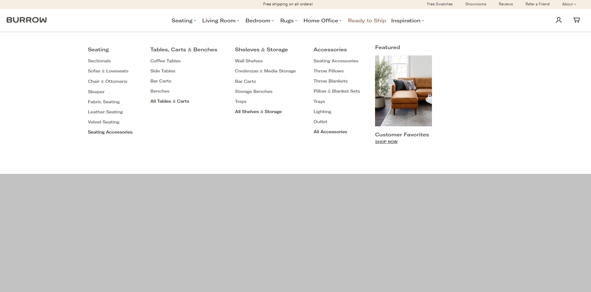
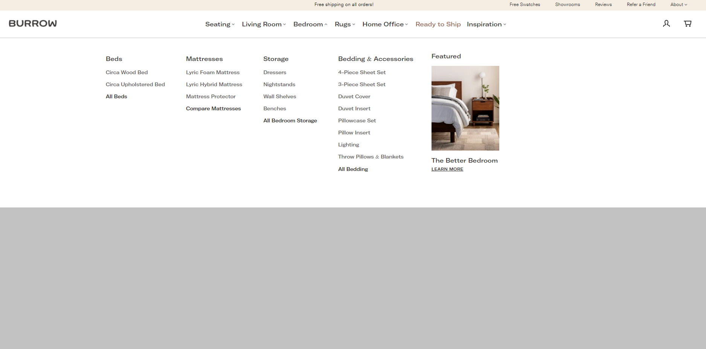
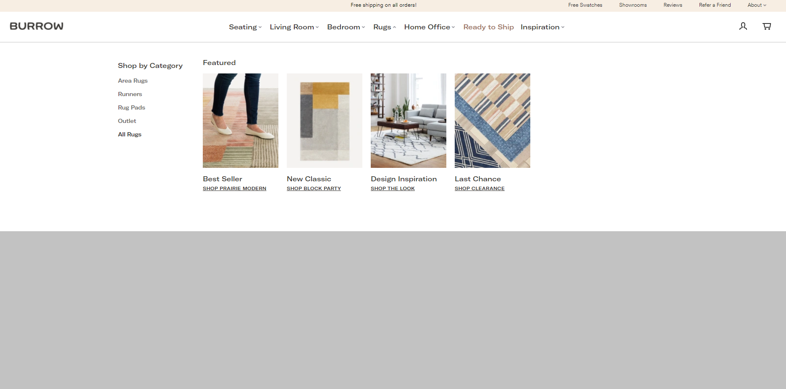
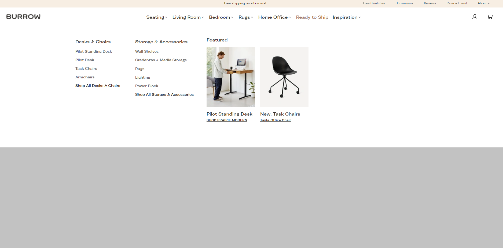
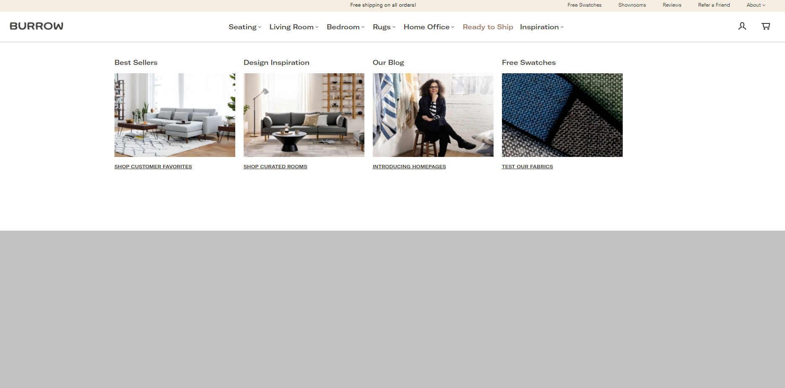

  
  

   
  

  <h1 align="center"><b>testWeb</b></h1>
  

  A test website
     
     
    <b>Download for </b>
    macOS
    ·
    Windows
    ·
    Linux
    ·
    iOS
    ·
    watchOS
    ·
    Android
     
    <i>~ download whenever you want ~</i>
  

---
Zkušební webová stránka

## Spustit lokálně

Stáhněte projekt

>   stahněte zip tady > https://github.com/MikeB35/testPage
>   
>   Otevřte složku projektu
>   
>   Spusťte index.html soubor

# Proces tvorby
Základ
1. Vytvářím nový soubor .html a .less(přehlednější pro programátora a rychleji nastavitelný)
2. Pomoci aplikaci "Koala" dále budu konvertovat soubor .less do .css(základní soubor pro styly)
3. Dívám se na ukázku, stahuju potřebná písma, obrázky atd.
4. Předem prohlížím a zkoumám/vymýšlím strukturu webu
5. Píšu kód html, css a pořebný JavaScript
6. Během tvorby webové stránky ukládam backupy(předchozí verze kódu, kterou se dá, po případě poškození lokálneho kódu, stáhnout a tím se vrátit o krok zpět) na github

# Aplikace
Pro práci jsem použil tyto aplikace
1. Atom (IDE) - https://atom.io/
2. GitHubDesktop - https://desktop.github.com/
3. Koala (less compiler) - http://koala-app.com/
4. Adobe Photoshop
5. Figma

# Screenshots

## Authors

- [@MikeB35](https://www.github.com/MikeB35)
